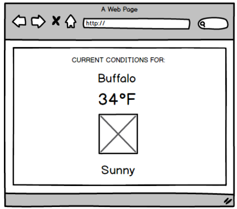

#Take-Home Challenge

##Instructions from Synacor

Build a simple JavaScript app/widget that does the following:

1. Makes a GET request to the provided IP geolocation API, which returns a JSON response containing the latitude and longitude for the IP address from which the request originated;

2. Makes a subsequent request to the given weather API, which returns the current conditions for the latitude and longitude from the first step;

3. Renders a User Interface that displays the temperature, a text description of the current weather conditions, an icon representing those conditions, and the city.

####The API

We have deployed a CORS-enabled API for IP geolocation and weather lookup at

https://weathersync.herokuapp.com. There are two endpoints:

`/ip`

Get the geographic location of the requestor’s IP

`/weather/$lat,$lng`

Get weather for a given latitude & longitude

*Note: Icons*

*The icon property returned from the weather endpoint can be used to request a PNG icon image using this URL:*

`http://openweathermap.org/img/w/${icon}.png`

(example: http://openweathermap.org/img/w/03n.png)

####Acceptance criteria

You may use any version of JavaScript/ECMAScript you like.

Code must be written by you, with no libraries or dependencies.

Must run in modern browsers (Chrome & Firefox are fine). Don’t worry about supporting old browsers.

The User Interface should fill the browser window.

A wireframe is attached, describing what the layout should look like. Feel free to use whatever colors, fonts, and other design elements you like. Note: other than the requirements stated above, you won’t be judged on design.

####Interface Mock-up

##My Notes
The production app is completely free of dependencies.

The build environment uses JSLint and SASS to aid in development. For development, execute from the command line:`npm install` then either: `grunt sass` or `grunt lint`.

I did not try an make any optimizations for production (i.e. minification and concatenation of js and css files) as it hinders code evaluation.

Since this is an AJAX application, it needs to be run from a server. **It will not work when loaded as a file.**

I have hosted the test on my AWS account which can be viewed [here](https://s3-us-west-1.amazonaws.com/synacor-mgable/index.html, "Synacor Test on AWS") .

I found this a very enjoyable exercise.
